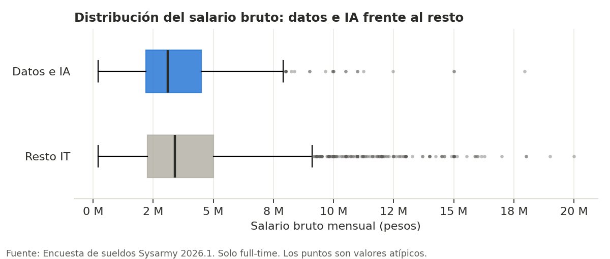
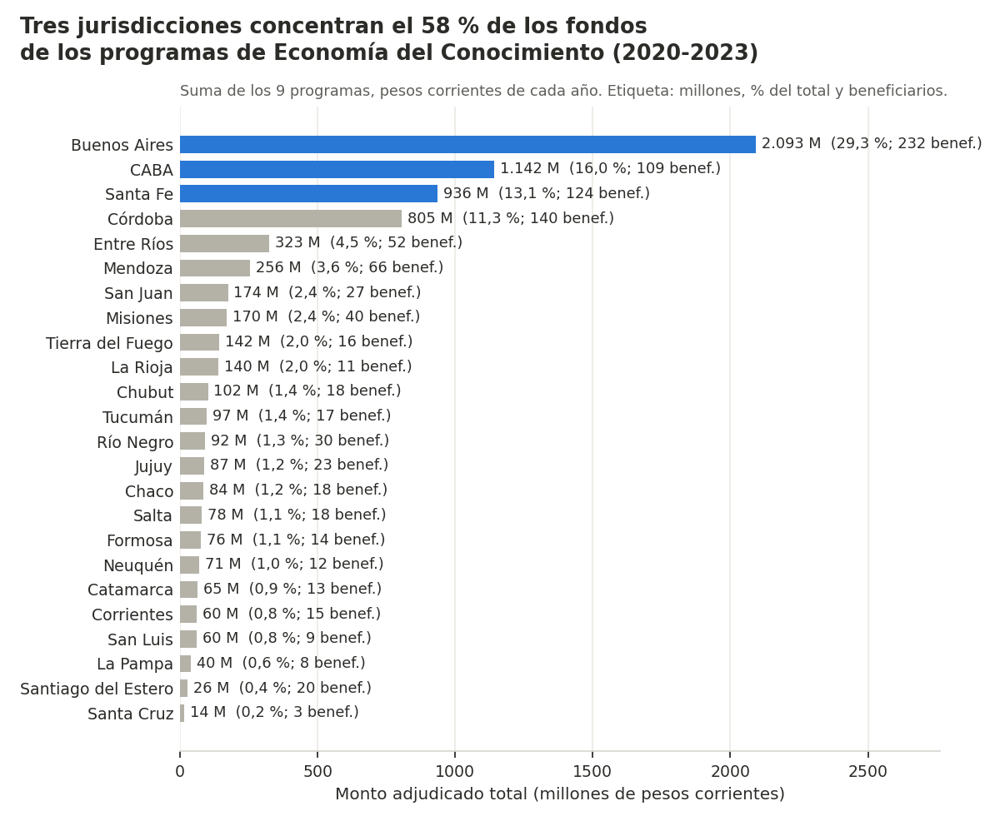
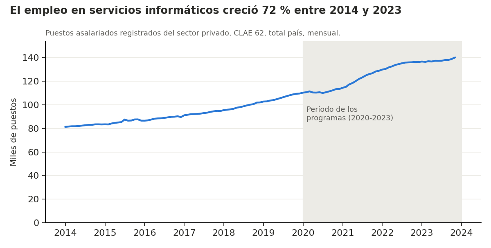
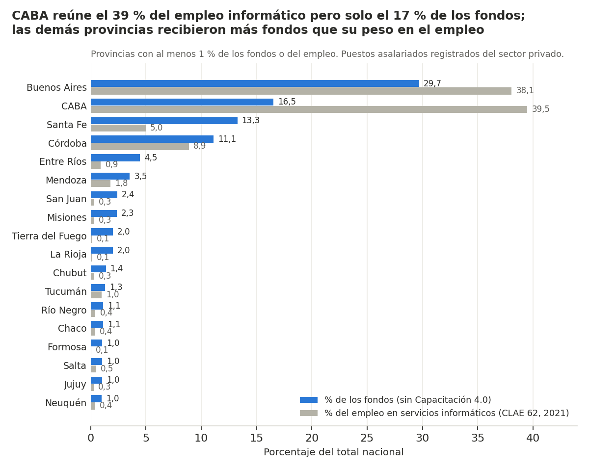

# Economía del Conocimiento en Argentina – Análisis descriptivo

**Equipo 3 - PP1 - Economía del Conocimiento - 2C - 2026**
Prácticas Profesionalizantes 1 · Tecnicatura Superior en Ciencia de Datos e IA · Politécnico Malvinas Argentinas

## Integrantes del equipo
- Jordana Escalona – Analista de Datos / Documentadora
- David Moreira – Coordinador de Recursos / Responsable de Calidad de Datos
- José Luis Martín – Diseñador de Visualizaciones
- Alejandro Suarez – Encargado de Entrega / Comunicador del equipo

---

## Descripción del proyecto
La Ley 27.506 de Economía del Conocimiento promueve actividades como el software y los servicios informáticos, la industria 4.0, la inteligencia artificial, la biotecnología y el audiovisual. Este proyecto realiza un **análisis descriptivo** con datos públicos para conocer el sector desde dos ejes:

1. **Talento:** cuánto cobran los puestos vinculados a datos e inteligencia artificial frente al resto de los puestos IT.
2. **Territorio:** cómo se distribuyeron entre las provincias los fondos de los programas de promoción (2020-2023) y si coinciden con el empleo en servicios informáticos.

El análisis es descriptivo: cuenta, resume y compara. No busca explicar causas ni medir el impacto de los programas.

---

## Fuente de datos
| Dataset | Fuente | Tipo de datos | Registros |
|---|---|---|---|
| Encuesta de sueldos Sysarmy 2026.1 | [Sysarmy / OpenQube](https://sueldos.openqube.io/encuesta-sueldos-2026.01/) | Encuesta a trabajadores IT (salarios, puesto, seniority, uso de IA) | 4.939 |
| 9 programas de la Economía del Conocimiento (SOLUCIONA I, II y VERDE, NODOS, Producción Colaborativa, FORTALECER, POTENCIAR Satelital y Videojuego, Capacitación 4.0) | [datos.gob.ar](https://datos.gob.ar) – Ministerio de Economía | Beneficios otorgados: beneficiario, provincia, monto | 1.035 |
| Puestos de trabajo por departamento y rama CLAE2 | [CEP XXI – datos.gob.ar](https://datos.gob.ar/dataset/puestos-de-trabajo-por-departamento-partido-y-sector-de-actividad) | Empleo asalariado registrado privado, mensual 2014-2023 | 3.592.707 |

Enlaces de cada archivo: [`data/raw/LEEME.md`](data/raw/LEEME.md).

---

## Objetivos del análisis
**Objetivo general:** describir la Economía del Conocimiento en Argentina a partir del talento en datos e IA y de la distribución territorial del financiamiento público al sector.

**Objetivos específicos:**
1. Comparar el salario de los puestos de datos e IA con el del resto de los puestos IT.
2. Identificar qué provincias recibieron los mayores montos de los programas y cuántos beneficios tuvo cada una.
3. Comparar el ranking de provincias según los fondos recibidos con el ranking según el empleo en servicios informáticos.

---

## Herramientas utilizadas
- **Python** (pandas, matplotlib): EDA inicial – Sprint 1
- **Pentaho Data Integration**: proceso ETL – Sprint 2
- **MySQL**: base de datos con los datos limpios – Sprint 2
- **Power BI**: dashboard y visualizaciones finales – Sprint 3
- Excel / CSV, Google Drive, Trello, GitHub, Google Meet y WhatsApp

---

## Proceso de análisis
- **Sprint 1 (completado):** organización del equipo, ficha de conocimiento del dominio, preguntas de análisis, diccionario de datos y EDA inicial sobre los datos originales.
- **Sprint 2:** limpieza y transformación (ETL) según los problemas detectados en el EDA, carga en MySQL, patrones e insights.
- **Sprint 3:** visualización en Power BI, data storytelling y presentación final.

### Cómo reproducir el EDA
```bash
pip install -r requirements.txt
python analysis/eda_sprint1.py
```
Antes, copiar en `data/raw/` el archivo del CEP XXI, que no está en GitHub por su tamaño (ver [`data/raw/LEEME.md`](data/raw/LEEME.md)). El script genera `reports/sprint1/eda_resumen.xlsx` y los gráficos de `reports/sprint1/graficos/`.

---

## Resultados principales
*Observaciones iniciales del Sprint 1 (se profundizarán en el Sprint 2):*
- Los puestos de datos e IA son el 8,9 % de las respuestas de Sysarmy. Su mediana salarial total es algo menor que la del resto ($3,10 M frente a $3,40 M, full-time), posiblemente porque el grupo tiene menos personas senior.
- Los 9 programas otorgaron 1.035 beneficios por $7.133 M (pesos corrientes) entre 2020 y 2023 y llegaron a las 24 jurisdicciones; Buenos Aires, CABA, Santa Fe y Córdoba reúnen cerca del 70 %.
- Las provincias con más fondos son también las de más empleo informático, pero las proporciones no coinciden: CABA y Buenos Aires tienen una parte del empleo mayor que su parte de los fondos.
- **Calidad de datos:** nombres de provincia y de columnas distintos entre archivos, montos en pesos de distintos años, valores protegidos (-99) en el CEP XXI y valores imposibles en algunas variables de Sysarmy. Se corrigen en el ETL del Sprint 2.

---

## Visualizaciones





---

## Conclusiones
Se completarán en el Sprint 3, una vez finalizados la limpieza de datos y el análisis.

---

## Estructura del repositorio
```
├── README.md
├── requirements.txt
├── data/
│   ├── raw/          → datos originales sin modificar (+ LEEME.md con las fuentes)
│   └── processed/    → datos limpios (Sprint 2)
├── analysis/
│   └── eda_sprint1.py → script del EDA inicial
├── docs/
│   ├── PP1-S1-Ficha-Conocimiento-del-Dominio.docx
│   ├── PP1-S1-Preguntas-de-analisis.docx
│   └── PP1-S1-Diccionario-de-Datos.xlsx
└── reports/
    └── sprint1/
        ├── PP1-S1-EDA-Inicial.docx
        ├── PP1-S1-Ficha-Seguimiento-Sprint.docx
        ├── eda_resumen.xlsx
        └── graficos/
```
